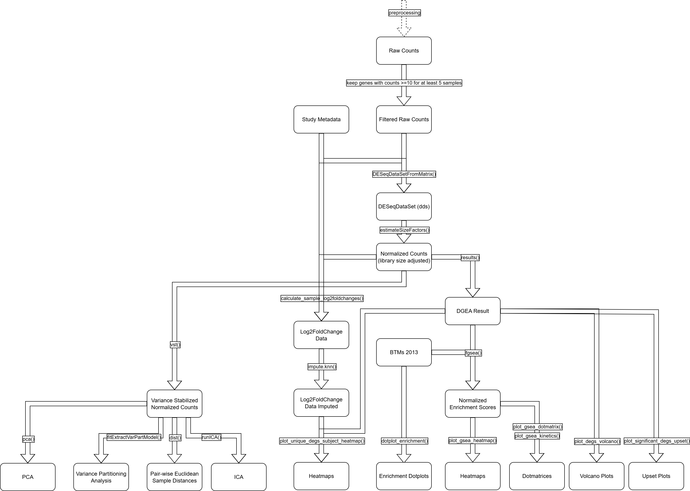

# Overview
A repository to backup the scripts we used for bulkRNA data analysis during my Master's thesis (without confidential data or results for public display).
This is a longitudinal study of transcriptomic activity after influenza vaccination in human blood samples.

Our code features a data cleanup pipeline, quality control measures, exploratory data analysis, variance partitioning analysis, differential gene expression analysis, complex heatmaps, volcano plots and correlations of gene counts with antibody titers.

# Installation
Here is how, given all necessary data was available, one could reproduce the analysis:  

`git clone https://github.com/rschaeper/rna_seq_analysis-public/tree/main` (clone repository)  
`cd rna_seq_analysis-public` (move into project root directory)  
`R -e "renv::restore()"` (detect and install the exact versions of the packages used during development)  
`chmod +x pipeline.sh` (make pipeline script executable)  
`./pipeline.sh` (run pipeline which loads functions.R and then executes scripts in order)

# Scripts
`pipeline.sh`: Helper script to run all parts of the analysis one after each other  
`functions.R`: Acts as global script and should be loaded into environment before any other script

### Preprocessing
These scripts need to be executed in order.  
`00_cleanup_metadata.R`: Reads in raw metadata files, and formats and assembles them into a singular dataframe  
`01_extract_data.R`: Reads in raw count data and assembled metadata from `00_cleanup_metadata.R` to construct DESeq2DataSet object and l2fc_data  
`02_initial_qc.R`: Creates quality control plots, excludes samples and calculates sample Euclidean distances  

### Analysis
The following scripts can be executed independently, if the preprocessing scripts have run and `functions.R` is loaded.  
`03_exploratory_analysis.R`: Performs exploratory data analysis via variance partitioning, metadata correlation, sample Euclidean distances heatmaps and PCA  
`04_differential_gene_expression.R`: Main script that performs differential gene expression analysis and gene set enrichment  
`05_study_data_correlations.R`: Performs correlations between gene counts and log2FoldChange in gene counts with day 30 titer response index  

`unused.R`: All blocks of code which were not necessary for the final thesis figures, but might still be useful for further analyses.

# Code Diagram
This overview shows, roughly, how counts are manipulated to yield various plots.  
  

# Folder Structure
```
202501_RS_bulkRNA-analysis/
├── pipeline.sh
├── functions.R
├── 00_cleanup_metadata.R
├── 01_extract_data.R
├── 02_initial_qc.R
├── 03_exploratory_analysis.R
├── 04_differential_gene_expression_analysis.R
├── 05_correlation.R
├── unused.R
├── 202501_RS_bulkRNA-analysis.Rproj
├── LICENSE
├── README.md
├── cleaned_output
│   ├── README.md
│   ├── sample_metadata.csv
│   ├── sample_metadata.xlsx
│   ├── subject_metadata.csv
│   └── subject_metadata.xlsx
├── data
│   ├── README.md
│   ├── antibody
│   ├── counts
│   ├── gene_sets
│   └── meta
├── doc
│   ├── README.md
│   ├── Transcriptomic_Response_to_Influenza_Vaccination_in_Health_and_Disease_by_Robin_Schaeper_2025.pdf
│   └── Transcriptomic_Response_to_Influenza_Vaccination_in_Health_and_Disease_by_Robin_Schaeper_2025_compressed.pdf
├── figs
│   ├── README.md
│   ├── analysis
│   ├── correlation
│   ├── exploration
│   └── qc
├── output
│   ├── HC_V1_contrast_dds.rds
│   ├── HC_nes.rds
│   ├── MM_V1_contrast_dds.rds
│   ├── MM_nes.rds
│   ├── NSCLC_V1_contrast_dds.rds
│   ├── NSCLC_nes.rds
│   ├── README.md
│   ├── SMM_V1_contrast_dds.rds
│   ├── SMM_nes.rds
│   ├── V1_HC_contrast_dds.rds
│   ├── V1_nes.rds
│   ├── V2_HC_contrast_dds.rds
│   ├── V2_nes.rds
│   ├── V3_HC_contrast_dds.rds
│   ├── V3_nes.rds
│   ├── V4_HC_contrast_dds.rds
│   ├── V4_nes.rds
│   ├── V5_HC_contrast_dds.rds
│   ├── V5_nes.rds
│   ├── V6_HC_contrast_dds.rds
│   ├── V6_nes.rds
│   ├── dds.rds
│   ├── dds_qc.rds
│   ├── euclid_dists.rds
│   ├── euclid_dists_qc.rds
│   ├── gsea_results_count_igg_corr.rds
│   ├── gsea_results_count_igg_corr_cohort.rds
│   ├── gsea_results_count_tri_corr.rds
│   ├── gsea_results_count_tri_corr_cohort.rds
│   ├── gsea_results_l2fc_count_igg_corr.rds
│   ├── gsea_results_l2fc_count_tri_corr.rds
│   ├── gsea_results_l2fc_igg_corr_cohort.rds
│   ├── gsea_results_l2fc_tri_corr_cohort.rds
│   ├── l2fc_data.rds
│   ├── l2fc_data_imputed.rds
│   ├── l2fc_data_imputed_qc.rds
│   ├── l2fc_data_qc.rds
│   ├── l2fc_euclid_dists.rds
│   ├── l2fc_pathway_data.rds
│   ├── metadata.rds
│   ├── pathway_data.rds
│   ├── raw_count_matrix_rounded.rds
│   └── subject_metadata.rds
├── renv
│   ├── activate.R
│   ├── library
│   ├── settings.json
│   └── staging
└── renv.lock
```
